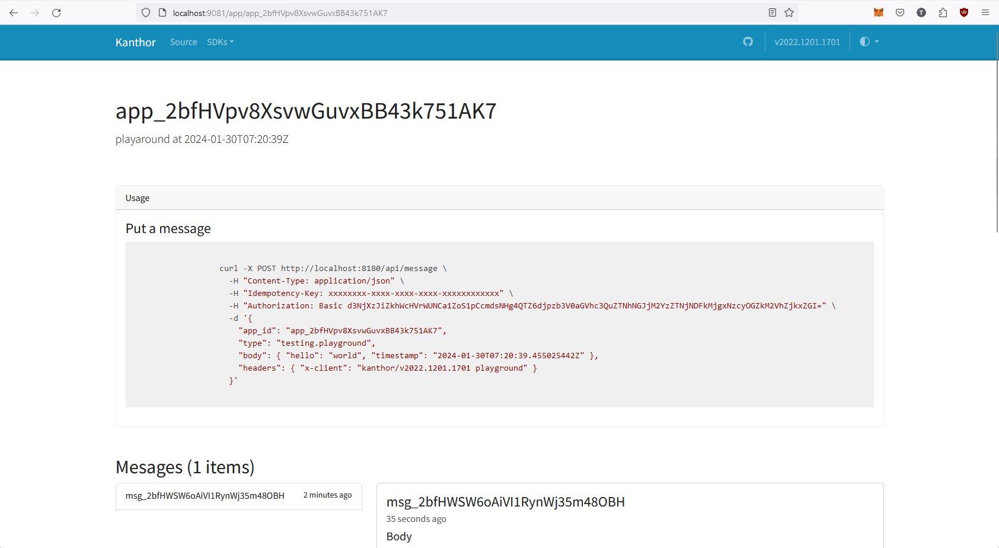
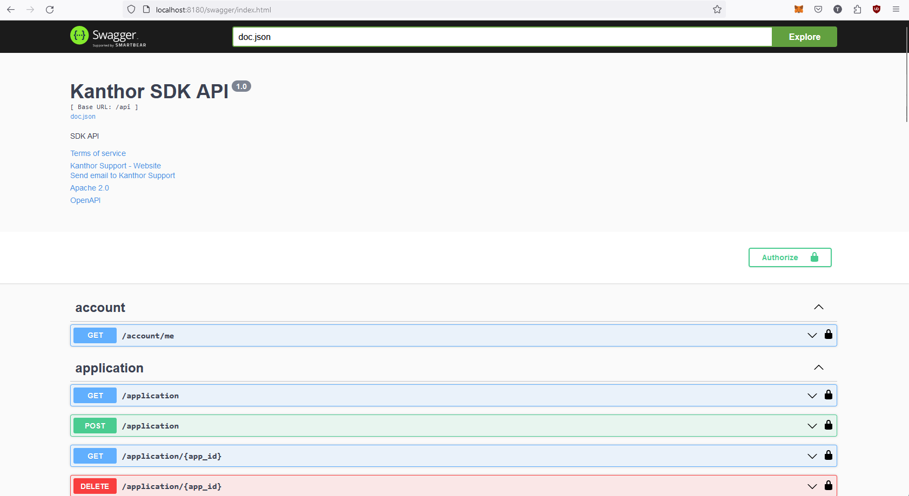

import Tabs from '@theme/Tabs';
import TabItem from '@theme/TabItem';

# Introduction

Kanthor is an Open-source Webhook Gateway that help you manage message deliver easier. The system is focusing on ship the best experirence to the developer who using this system and the devops engineer who operate this system.

Kanthor principles are heavily inspired by the book **Designing Data-Intensive Applications** what describes which characteristics of a data-instensive system should have

- Reliability: Tolerating hardware and software faults as well as human errors
- Scalability: Measuring load and performance as well as latency percentiles and throughput
- Maintainability: Operatbility, simplicity and evolvability

## Setup

### Docker Compose

The easier way to boostrap the Kanthor system in your machine is via Docker Compose

```bash
# create project directory
mkdir -p kanthor-project
# navigate to our root project directory
cd kanthor-project
# download the latest docker-compose.yaml
curl https://raw.githubusercontent.com/scrapnode/kanthor/master/docker-compose.latest.yaml -o docker-compose.yaml
# start the project
docker compose up -d
```

Then you can access to the Kanthor system via those interfaces

- [Kanthor Playground](http://localhost:9081): The Kanthor playground that is built on top of the [Kanthor SDK for Golang](https://github.com/scrapnode/kanthor-sdk-go). So you can place with it to test the functionability or reference to it as a guideline of how to using the Kanthor SDK
- [Kanthor Console](http://localhost:9082): The Kanthor Console UI that allow you configure the customer portal. Default user is `admin@kanthorlabs.com` and default password is `changemenow`
- [Kanthor SDK OpenAPI](http://localhost:8180/swagger/index.html): The OpenAPI document UI of all of the available API in the Kanthor SDK service
- [Kanthor Portal OpenAPI](http://localhost:8280/swagger/index.html): The OpenAPI document UI of all of the available API in the Kanthor Portal service

### Screenshots

<Tabs
defaultValue="playground"
values={[
{label: "Playground", value: "playground"},
{label: "Console", value: "console"},
{label: "SDK OpenAPI", value: "sdk"},
{label: "Portal OpenAPI", value: "portal"},
]}>
<TabItem value="playground">

</TabItem>

<TabItem value="console">

</TabItem>

<TabItem value="sdk">

</TabItem>

<TabItem value="portal">

</TabItem>
</Tabs>
