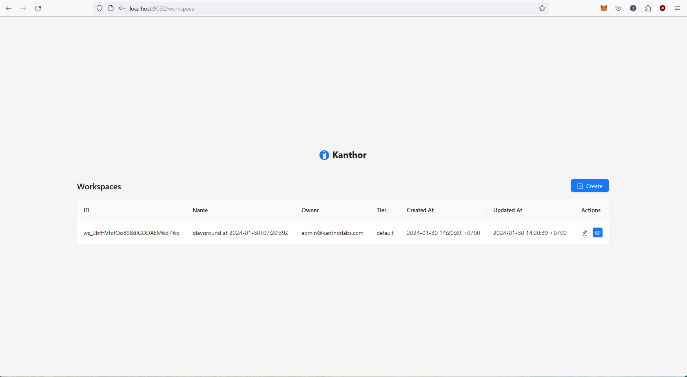
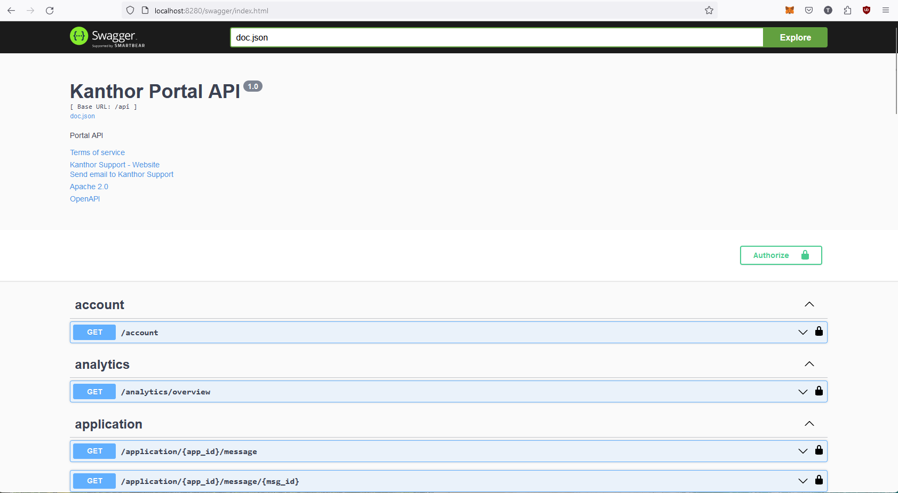

import Tabs from '@theme/Tabs';
import TabItem from '@theme/TabItem';
import ReactPlayer from 'react-player'
import demo from './assets/video/demo.webm'

# Introduction

Kanthor is an open-source Webhook Gateway designed to streamline message delivery management. The system prioritizes delivering the best experience to both developers utilizing the system and the DevOps engineers overseeing its operation.

Kanthor's principles draw heavily from the book **Designing Data-Intensive Applications** which outlines essential characteristics for data-intensive systems:

- Reliability: Tolerating hardware and software faults as well as human errors
- Scalability: Measuring load and performance as well as latency percentiles and throughput
- Maintainability: Operatbility, simplicity and evolvability

## Setup

### Docker Compose

The easier way to boostrap the Kanthor system in your machine is via Docker Compose

```bash
# create project directory
mkdir -p kanthor-project
# navigate to our root project directory
cd kanthor-project
# download the latest docker-compose.yaml
curl https://raw.githubusercontent.com/scrapnode/kanthor/master/docker-compose.latest.yaml -o docker-compose.yaml
# start the project
docker compose up -d
```

You can access the Kanthor system through various interfaces:

- [Kanthor Playground](http://localhost:9081): Utilize the Kanthor Playground, built on the [Kanthor SDK for Golang](https://github.com/scrapnode/kanthor-sdk-go), to experiment with functionalities or refer to it as a guide on how to use the Kanthor SDK.
- [Kanthor Console](http://localhost:9082): Access the Kanthor Console UI to configure the customer portal. The default credentials are:

  - Username: `admin@kanthorlabs.com`
  - Password: `changemenow`

- [Kanthor SDK OpenAPI](http://localhost:8180/swagger/index.html): Explore the OpenAPI document UI containing all available APIs in the Kanthor SDK service.
- [Kanthor Portal OpenAPI](http://localhost:8280/swagger/index.html): Access the OpenAPI document UI featuring all available APIs in the Kanthor Portal service.

### Screenshots

<Tabs
defaultValue="playground"
values={[
{label: "Playground", value: "playground"},
{label: "Console", value: "console"},
{label: "SDK OpenAPI", value: "sdk"},
{label: "Portal OpenAPI", value: "portal"},
]}>
<TabItem value="playground">

</TabItem>

<TabItem value="console">

</TabItem>

<TabItem value="sdk">

</TabItem>

<TabItem value="portal">

</TabItem>
</Tabs>

## Demo Video

There is a demo video showcasing the functionality of the Kanthor Webhook System using Kanthor Playground and Kanthor Console.

<ReactPlayer controls url={demo} width="100%" />
