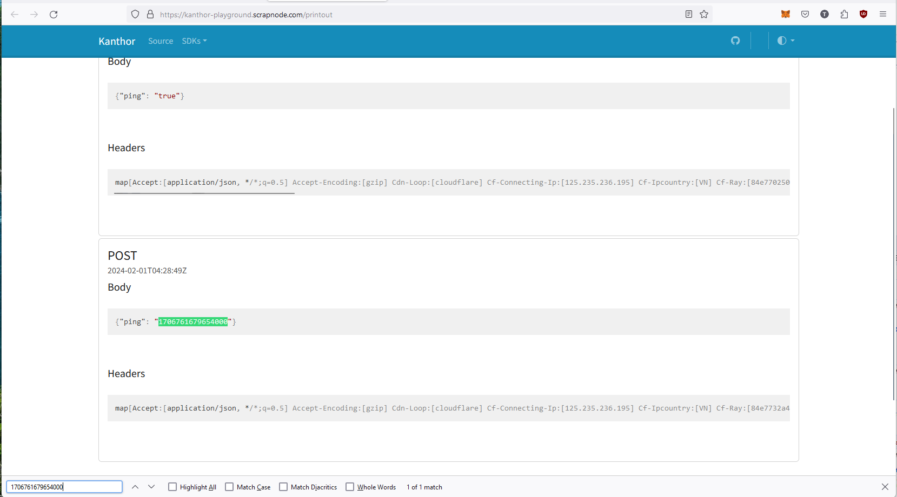

import Tabs from '@theme/Tabs';
import TabItem from '@theme/TabItem';

# Integration

After playing with Kanthor's exposed interfaces, we will guide you how to integrate Kanthor into codebase with our pre-built SDKs

## Installation

<Tabs
defaultValue="go"
values={[
{label: "Go", value: "go"},
{label: "Javascript", value: "javascript"},
]}>
<TabItem value="go">

```bash
go get github.com/scrapnode/kanthor-sdk-go
```

</TabItem>

<TabItem value="javascript">

```bash
# comming soon
```

</TabItem>

</Tabs>

## Creating a consumer application

To start integrating with Kanthor, you'll first need an application. This serves as the entry point of the system, receiving your messages and initiating actions for their delivery.

<Tabs
defaultValue="go"
values={[
{label: "Go", value: "go"},
{label: "Javascript", value: "javascript"},
]}>
<TabItem value="go">

```go
import kanthorsdk "github.com/scrapnode/kanthor-sdk-go"

sdk := kanthorsdk.New("SDK_CREDENITALS")
ctx, cancel := context.WithTimeout(context.Background(), time.Minute)
defer cancel()

app, err := sdk.Application.Create(ctx, &kanthorsdk.ApplicationCreateReq{
    Name: "playground",
})
if err != nil {
    panic(err)
}
```

</TabItem>

<TabItem value="javascript">

```javascript
# comming soon
```

</TabItem>

</Tabs>

## Creating a delivery endpoint

Before sending a message, we must specify where it will be delivered once received by our application. Therefore, we need to create two additional entities: an endpoint and its filter rules.

For this demo, we'll utilize a dummy endpoint to showcase the workflow, along with a rule that permits all messages to be delivered to the configured endpoint. If you're unsure why these entities are necessary or how to configure them correctly, please bear with us - we'll introduce them to you shortly.

<Tabs
defaultValue="go"
values={[
{label: "Go", value: "go"},
{label: "Javascript", value: "javascript"},
]}>
<TabItem value="go">

```go
import kanthorsdk "github.com/scrapnode/kanthor-sdk-go"

sdk := kanthorsdk.New("SDK_CREDENITALS")
ctx, cancel := context.WithTimeout(context.Background(), time.Minute)
defer cancel()

// start of hidden code blocks
// ...
// end of hidden code blocks

ep, err := sdk.Endpoint.Create(ctx, &kanthorsdk.EndpointCreateReq{
    // use the app object in previous step
    AppId:  app.Id,
    // using the POST method
    Method: http.MethodPost,
    Name:   "POST endpoint",
    // using an dummy endpoint to demo
    Uri:    "https://kanthor-playground.scrapnode.com/printout",
})
if err != nil {
    panic(err)
}

// delivery any message of the application to configured endpoints
_, err = sdk.EndpointRule.Create(ctx, &kanthorsdk.EndpointRuleCreateReq{
    ConditionExpression: routing.MatchEqual(app.Id),
    ConditionSource:     routing.ConditionSourceAppId,
    EpId:                ep.Id,
    Exclusionary:        false,
    Name:                "passthrough all messages",
    Priority:            100,
})
if err != nil {
    panic(err)
}
```

</TabItem>

<TabItem value="javascript">

```javascript
# comming soon
```

</TabItem>

</Tabs>

## Sending a message

Finally, we've reached the interesting part. To send a message to your application, you'll need to prepare:

- An `app_id`, which you can obtain from the previous step.
- A type (e.g., `testing.playground`) to distinguish different categories of your message.
- The body of your message, which must be a map/object/dictionary based on your chosen programming language.
- Any additional headers you want to send to your endpoint.

<Tabs
defaultValue="go"
values={[
{label: "Go", value: "go"},
{label: "Javascript", value: "javascript"},
]}>
<TabItem value="go">

```go
import kanthorsdk "github.com/scrapnode/kanthor-sdk-go"

sdk := kanthorsdk.New("SDK_CREDENITALS")
ctx, cancel := context.WithTimeout(context.Background(), time.Minute)
defer cancel()

// start of hidden code blocks
// ...
// end of hidden code blocks

_, err = sdk.Message.Create(ctx, &kanthorsdk.MessageCreateReq{
    AppId:   app.Id,
    Type:    "testing.playground",
    Body:    map[string]interface{}{"ping": +time.Now().UnixNano()},
    Headers: map[string]string{"X-Powered-By": "Kanthor SDK"},
})
if err != nil {
    panic(err)
}
```

</TabItem>

<TabItem value="javascript">

```javascript
# comming soon
```

</TabItem>

</Tabs>

After sending the message, you can navigate to our dummy website, [Kanthor Printout](https://kanthor-playground.scrapnode.com/printout), to verify whether the message was successfully delivered to the endpoint. We've included a screenshot to give you a visual representation of what it looks like.

:::tip

If you cannot locate your message, try adding a unique property to the message body. Then, use **Ctrl + F** to search for that value. It's not a convenient, but it's work ;)

:::


