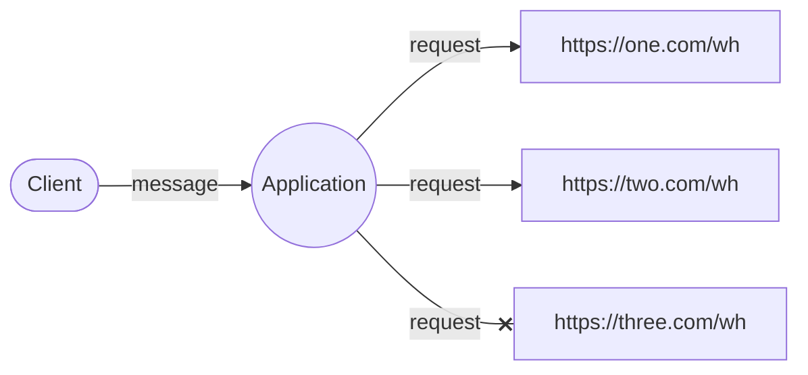
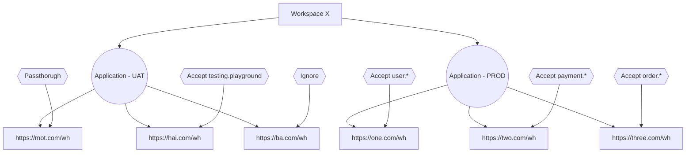

# Overview

This section provides an overview of the main concepts of Kanthor and how to use them.

## Overall

The fundamental concept of the Kanthor system can be described in a single sentence: a client sends a message to an application, which then generates a request to the corresponding endpoints based on that message. The following flowchart visualizes this idea to help you understand it clearly.

## Main Concepts

There are _seven_ main concepts that we need to introduce to you

- **Client**: The sender or producer responsible for generating and dispatching `message`s to our **Application**. This includes SDKs in various programming languages, cURL, or the OpenAPI interface.
- **Application**: The primary entry point for the Kanthor system, where `message`s are received and actions are initiated. It handles tasks such as generating `request`s and scheduling them.
- **Endpoint**: Configured destinations (typically URLs, but extendable to other [Uniform Resource Identifier](https://en.wikipedia.org/wiki/Uniform_Resource_Identifier) formats) for generated `request`s. Each endpoint requires at least one **Endpoint Rule** to begin processing requests.
- **Endpoint Rule**: A set of rules determining whether a `message` will be scheduled for sending to an **Endpoint** or ignored.
- **Message**: An entity sent by a client, containing relevant information.
- **Request**: Generated based on a `message` and an **Endpoint**
- **Response**: The outcome returned by an **Endpoint**, indicating the success or failure of processing a `message` and `request`.

All of these concepts will be encapsulated within an entity called **Workspace**. One common use case for **Workspace** is having separate environments, such as UAT and PROD, to prevent interfering with your PROD environment with dummy data.

