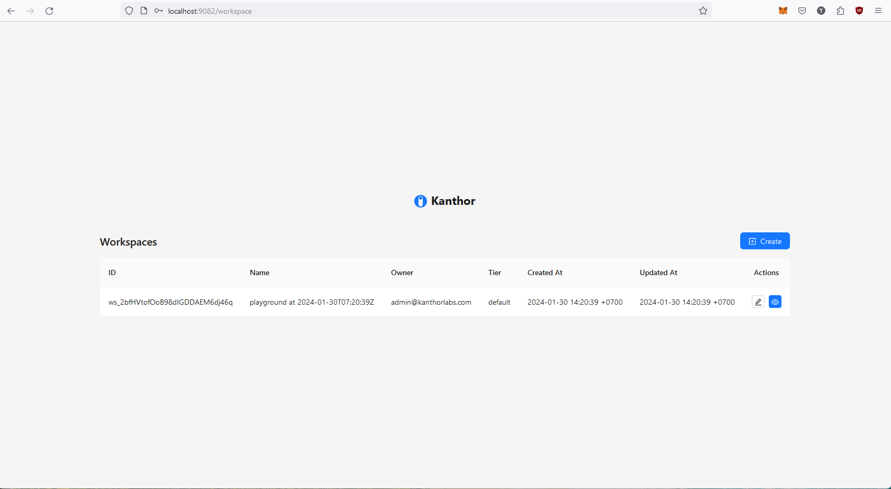

import Tabs from '@theme/Tabs';
import TabItem from '@theme/TabItem';
import ReactPlayer from 'react-player'
import demo from './assets/video/demo.webm'

# Quickstart

In this post, we'll guide you through setting up a Kanthor system on your local machine, allowing you to interact with its exposed interfaces. Additionally, we've included screenshots and a demo video to demonstrate how to utilize these interfaces once you've completed the installation successfully.

## Installation

The easiest way to set up the Kanthor system on your machine is through Docker Compose

```bash
# create project directory
mkdir -p kanthor-project
# navigate to our root project directory
cd kanthor-project
# download the latest docker-compose.yaml
curl https://raw.githubusercontent.com/scrapnode/kanthor/master/docker-compose.latest.yaml -o docker-compose.yaml
# start the project
docker compose up -d
```

You can access the Kanthor system through various interfaces:

- [Kanthor Playground](http://localhost:9081): Utilize the Kanthor Playground, built on the [Kanthor SDK for Golang](https://github.com/scrapnode/kanthor-sdk-go), to experiment with functionalities or refer to it as a guide on how to use the Kanthor SDK.
- [Kanthor Console](http://localhost:9082): Access the Kanthor Console UI to configure the customer portal. The default credentials are:

  - Username: `admin@kanthorlabs.com`
  - Password: `changemenow`

- [Kanthor SDK OpenAPI](http://localhost:8180/swagger/index.html): Explore the OpenAPI document UI containing all available APIs in the Kanthor SDK service.
- [Kanthor Portal OpenAPI](http://localhost:8280/swagger/index.html): Access the OpenAPI document UI featuring all available APIs in the Kanthor Portal service.

## Screenshots

<Tabs
defaultValue="playground"
values={[
{label: "Playground", value: "playground"},
{label: "Console", value: "console"},
{label: "SDK OpenAPI", value: "sdk"},
{label: "Portal OpenAPI", value: "portal"},
]}>
<TabItem value="playground">


</TabItem>

<TabItem value="console">



</TabItem>

<TabItem value="sdk">


</TabItem>

<TabItem value="portal">


</TabItem>
</Tabs>

## Demo Video

There is a demo video showcasing the functionality of the Kanthor Webhook System using Kanthor Playground and Kanthor Console.

<ReactPlayer controls url={demo} width="100%" />
