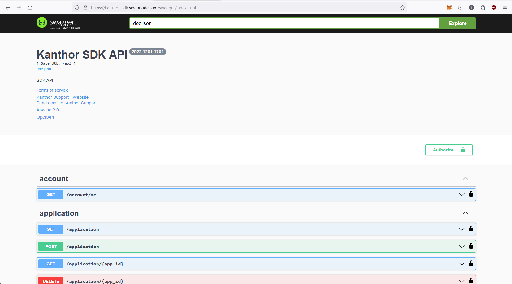

import Tabs from '@theme/Tabs';
import TabItem from '@theme/TabItem';

# Setup

To interact with the Kanthor System, the most convenient approach is utilizing the official Kanthor SDKs compatible with your preferred programming language. We support a range of languages, including Golang, JavaScript, Python, and .NET. However, if you're unable to locate an SDK for your language, you can also access the system through the REST API interface.

## SDK

<Tabs
defaultValue="go"
values={[
{label: "Go", value: "go"},
{label: "Javascript", value: "javascript"},
]}>
<TabItem value="go">

```bash
go get github.com/scrapnode/kanthor-sdk-go
```

</TabItem>

<TabItem value="javascript">

```bash
# comming soon
```

</TabItem>

</Tabs>

## REST

[Kanthor SDK API](https://kanthor-sdk.scrapnode.com/swagger/index.html)


